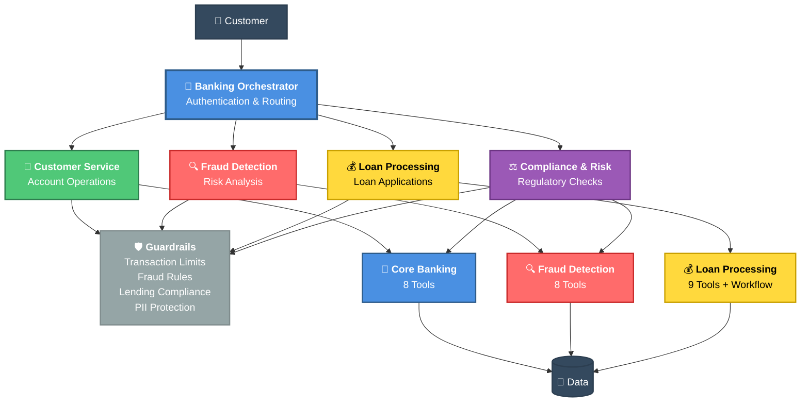

# Banking Demo - Architecture Diagram

## 🏗️ Complete System Architecture

This diagram shows the complete banking demo architecture including agents, toolkits, workflows, guardrails, and data flow.

## 📊 Architecture Components

### 🎯 Agents (5)
1. **Banking Orchestrator** - Primary customer interface with authentication and intelligent routing
2. **Customer Service** - Handles account operations (balance, transfers, history)
3. **Fraud Detection** - Real-time risk analysis and monitoring
4. **Loan Processing** - Automated loan applications and eligibility
5. **Compliance & Risk** - Regulatory checks and audit compliance

### 🛡️ Guardrails (4)
**Pre-Invoke (3):**
- **Transaction Limit** - Enforces daily and single transaction limits
- **Fraud Rules** - Risk scoring (0-100) with automatic blocking at ≥91
- **Lending Compliance** - FCA CONC 5.2A compliance checks

**Post-Invoke (1):**
- **PII Protection** - Automatic redaction of sensitive data

### 🔧 Tools & Workflows
**MCP Toolkits (3):**
- **Core Banking** - 8 tools (authentication, balance, transfers, etc.)
- **Fraud Detection** - 8 tools (risk analysis, AML, device verification, etc.)
- **Loan Processing** - 9 tools (eligibility, credit checks, offers, etc.)

**Agentic Workflows (1):**
- **Loan Approval Workflow** - Deterministic multi-step processing (60% faster)

### 📁 Data Layer (8 JSON Files)
- customers.json
- accounts.json
- transactions.json
- credit_reports.json
- loan_applications.json
- fraud_scenarios.json
- devices.json
- sessions.json

## 🔄 Request Flow

1. **Customer** sends banking request
2. **Orchestrator** authenticates and routes to appropriate specialist
3. **Pre-Invoke Guardrails** validate request (limits, fraud, compliance)
4. **Specialist Agent** processes request using tools/workflows
5. **Post-Invoke Guardrails** sanitize response (PII redaction)
6. **Customer** receives secure, compliant response

## 🎨 Color Legend

- 🔵 **Blue** - Orchestrator & Core Banking
- 🟢 **Green** - Customer Service & PII Protection
- 🔴 **Red** - Fraud Detection & Fraud Rules
- 🟡 **Yellow** - Loan Processing & Transaction Limits
- 🟣 **Purple** - Compliance & Lending Compliance
- 🟠 **Orange** - Agentic Workflow
- ⚫ **Gray** - Data Storage

## 📈 Key Metrics

- **5 Agents** - Multi-agent orchestration
- **25 Tools** - Across 3 MCP servers
- **1 Workflow** - Deterministic loan processing
- **4 Guardrails** - Security and compliance
- **8 Data Files** - UK-localized banking data
- **60 percent Faster** - Workflow vs agent-based processing
- **£32M+ Savings** - Annual (100k customers)
- **1,200%+ ROI** - Year 1

---

**Last Updated**: 2026-04-28  
**Version**: 1.0  
**Status**: ✅ Production Ready