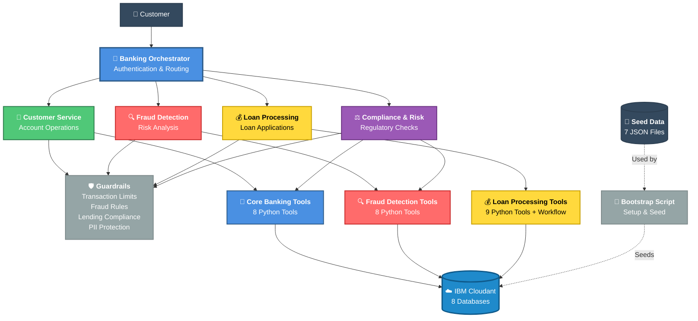

# Banking Demo - Architecture Diagram

## 🏗️ Complete System Architecture

This diagram shows the complete banking demo architecture including agents, Cloudant-backed Python tools, workflows, guardrails, and data flow.



## 📊 Architecture Components

### 🎯 Agents (5)
1. **Banking Orchestrator** - Primary customer interface with authentication and intelligent routing
2. **Customer Service** - Handles account operations (balance, transfers, history)
3. **Fraud Detection** - Real-time risk analysis and monitoring
4. **Loan Processing** - Automated loan applications and eligibility
5. **Compliance & Risk** - Regulatory checks and audit compliance

### 🛡️ Guardrails (4)
**Pre-Invoke (3):**
- **Transaction Limit** - Enforces daily and single transaction limits
- **Fraud Rules** - Risk scoring (0-100) with automatic blocking at ≥91
- **Lending Compliance** - FCA CONC 5.2A compliance checks

**Post-Invoke (1):**
- **PII Protection** - Automatic redaction of sensitive data

### 🔧 Tools & Workflows
**Standalone Python Tools (3 modules):**
- **Core Banking Tools** - 8 tools (authentication, balance, transfers, etc.)
- **Fraud Detection Tools** - 8 tools (risk analysis, AML, device verification, etc.)
- **Loan Processing Tools** - 9 tools (eligibility, credit checks, offers, etc.)

**Agentic Workflows (1):**
- **Loan Approval Workflow** - Deterministic multi-step processing (60% faster)

### ☁️ Data Layer

**IBM Cloudant (8 Databases):**
- customers - Customer profiles and authentication
- accounts - Account details and balances
- transactions - Transaction history
- credit - Credit reports and scores
- devices - Device fingerprints and trust data
- fraud - Fraud cases and risk analysis
- loans - Loan applications and offers
- audit - Audit logs and compliance records

**Seed Data (7 JSON Files):**
- customers.json
- accounts.json
- transactions.json
- credit_reports.json
- loan_applications.json
- fraud_scenarios.json
- devices.json

**Bootstrap Process:**
- `bootstrap_and_seed.py` - Creates databases, indexes, and seeds initial data
- Transforms JSON files into Cloudant documents
- Creates query indexes for performance
- Required for fresh installations

### 🏗️ Repository Layer
**Cloudant Repositories:**
- `AccountRepository` - Account data access
- `CustomerRepository` - Customer data access
- `TransactionRepository` - Transaction data access
- `CreditReportRepository` - Credit data access
- `DeviceRepository` - Device data access
- `FraudCaseRepository` - Fraud case data access
- `LoanApplicationRepository` - Loan data access

**Shared Infrastructure:**
- `cloudant_client.py` - Cloudant connection management
- `config.py` - Configuration and credential resolution
- `base.py` - Base repository with common query patterns

## 🔄 Request Flow

1. **Customer** sends banking request
2. **Orchestrator** authenticates and routes to appropriate specialist
3. **Pre-Invoke Guardrails** validate request (limits, fraud, compliance)
4. **Specialist Agent** processes request using Python tools
5. **Python Tools** query Cloudant via repositories
6. **Cloudant** returns data to tools
7. **Post-Invoke Guardrails** sanitize response (PII redaction)
8. **Customer** receives secure, compliant response

## 🔄 Data Flow Architecture

```
Customer Request
    ↓
Agent (with Guardrails)
    ↓
Python Tool (@tool decorator)
    ↓
Repository Layer
    ↓
Cloudant Client
    ↓
IBM Cloudant Database
    ↓
Response (with PII Protection)
    ↓
Customer
```

## 🎨 Color Legend

- 🔵 **Blue** - Orchestrator & Core Banking
- 🟢 **Green** - Customer Service
- 🔴 **Red** - Fraud Detection
- 🟡 **Yellow** - Loan Processing
- 🟣 **Purple** - Compliance & Risk
- 🔵 **Light Blue** - Cloudant Database
- ⚫ **Gray** - Infrastructure & Setup
- ⚫ **Dark Gray** - Seed Data Files

## 📈 Key Metrics

- **5 Agents** - Multi-agent orchestration
- **25 Python Tools** - Across 3 tool modules
- **1 Workflow** - Deterministic loan processing
- **4 Guardrails** - Security and compliance
- **8 Cloudant Databases** - Production data storage
- **7 Seed Files** - UK-localized banking data for setup
- **60% Faster** - Workflow vs agent-based processing
- **£32M+ Savings** - Annual (100k customers)
- **1,200%+ ROI** - Year 1

## 🔧 Technical Implementation

### Tool Architecture
```python
@tool
def authenticate_customer(customer_id: str, pin: str) -> Dict[str, Any]:
    """Standalone Python tool with Cloudant backend"""
    repo = CustomerRepository()
    customer = repo.get_by_id(customer_id)
    # Business logic
    return result
```

### Repository Pattern
```python
class CustomerRepository(BaseRepository):
    """Cloudant data access layer"""
    def get_by_id(self, customer_id: str) -> Optional[Dict]:
        return self.client.get_document(
            db=self.db_name,
            doc_id=customer_id
        ).get_result()
```

### Configuration Resolution
1. **watsonx Orchestrate** - Runtime connection lookup (production)
2. **Environment Variables** - Injected by platform
3. **Local .env** - Development only

## 🚀 Deployment Architecture

### Production (watsonx Orchestrate)
```bash
# 1. Import Cloudant connection
orchestrate connections import -f connections/cloudant-connection.yaml

# 2. Configure credentials
orchestrate connections configure --app-id cloudant --env draft --type team --kind key_value
orchestrate connections set-credentials --app-id cloudant --env draft --entries "api_key=$CLOUDANT_API_KEY"

# 3. Bootstrap Cloudant (one-time)
python cloudant-tools/scripts/bootstrap_and_seed.py

# 4. Import tools
orchestrate tools import -k python -f cloudant-tools/core_banking_tools.py
orchestrate tools import -k python -f cloudant-tools/fraud_detection_tools.py
orchestrate tools import -k python -f cloudant-tools/loan_processing_tools.py

# 5. Import workflow
orchestrate tools import -k flow -f tools/loan_approval_workflow.py

# 6. Import agents
orchestrate agents import -f agents/banking-orchestrator-agent.yaml
# ... (other agents)
```

### Local Development
```bash
# 1. Set up .env file with Cloudant credentials
# 2. Bootstrap databases
python cloudant-tools/scripts/bootstrap_and_seed.py

# 3. Run smoke tests
python cloudant-tools/tests_smoke.py
```

## 📝 Key Differences from Previous Architecture

### Before (MCP Servers)
- ❌ MCP server processes
- ❌ Stdio/SSE transport
- ❌ In-memory JSON data
- ❌ Toolkit imports

### After (Cloudant Python Tools)
- ✅ Standalone Python tools with `@tool` decorator
- ✅ Direct Cloudant integration
- ✅ Persistent database storage
- ✅ Repository pattern for data access
- ✅ Shared configuration and client utilities
- ✅ Production-ready scalability

---

**Last Updated**: 2026-05-05  
**Version**: 2.0 (Cloudant Implementation)  
**Status**: ✅ Production Ready